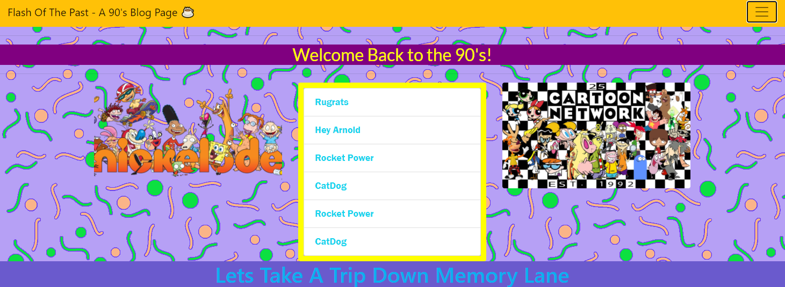

# my90's Blog Page

> This is solely HTML and CSS with Bootstrap

## Blog Post

Made a website with bootstrap that had a 90's theme to it. I our assignment was to render our favorite childhood past time and what we remembered from watching TV as a kid. I choose to focus on Cartoons and MTV. 

***Overview***

> Flash from the Past

> 90's Cartoons

> MTV

## LINKS

- [my90'sBlog Link](https://nicholasd-uci.github.io/my90page/)
- [GitHub Repo Link](https://github.com/nicholasd-uci/my90page)
- [Nicholas Dallas GitHub](https://github.com/nicholasd-uci)
- [Youtube Video Link](https://youtu.be/b8hc3MuRbb4)

- - -
© 2020 NPRD, Nicholas Paul Ruiz Dallas